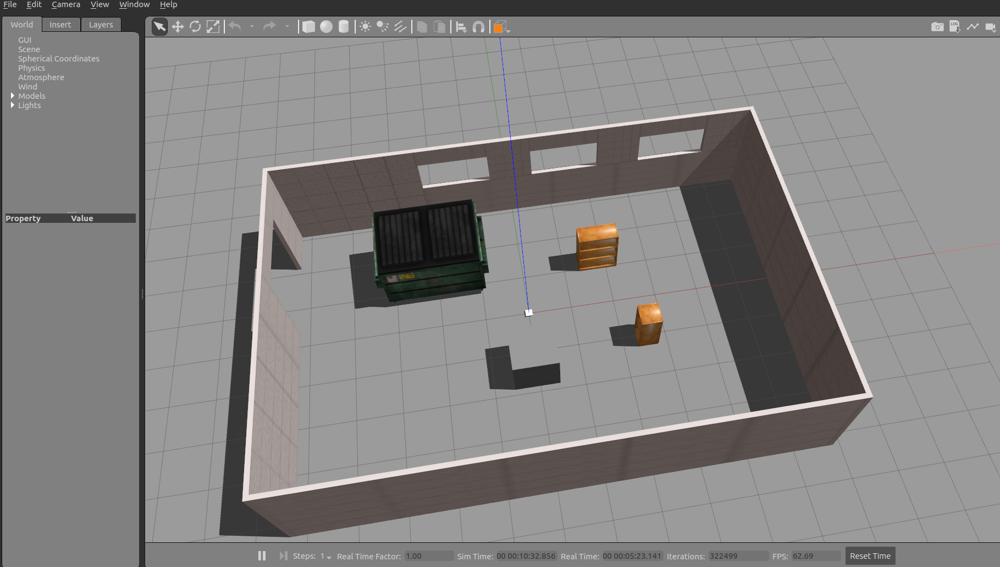

### Step by step instructions to ROS Navigation stack
Setup your catkin workspace
* `mkdir -p skidy_ws/src`
* `cd skidy_ws/src`
* `git clone https://github.com/ashBabu/ros_nav.git`
* `cd ../../`
* `catkin_make`
* `source devel/setup.bash`


`skidy_1_basic.urdf` is the very basic urdf with links and joints for a mobile robot. To view the urdf,
* `sudo apt-get install ros-melodic-urdf-tutorial`
* `roslaunch urdf_tutorial display.launch model:='$(find ros_nav)/urdf/001_skidy_basic.urdf'`


The above figure shows the Rviz with the 001_skidy_basic.urdf.

### Launch the skidy_urdf in Rviz
* `roslaunch ros_nav 001_skidy_in_rviz.launch`. Use the `Add` button to add `RobotModel` to view the robot in the Rviz window along with sliders to control the wheels.

### Creating a gazebo world
Official tutorial available [here](https://classic.gazebosim.org/tutorials?tut=build_world&ver=1.9).

Fire up a terminal and type the following
* `gazebo`  
this will launch the an `empty_world` in `gazebo`. Add primitives (sphere, cuboid etc.) or use the `Insert` tab to create your own world. Save your world under `ros_nav/gazebo_worlds/simple_world.world`.
* `roslaunch ros_nav 002_gazebo_world.launch` # to launch this

### Spawn skidy in gazebo
This requires adding the following to the `002_gazebo_world.launch` and is given in `003_gazebo_skidy.launch`

`  <node name="spawn_model" pkg="gazebo_ros" type="spawn_model" args="-urdf -param robot_description -model skidy " output="screen"/>
`

This will look as shown below




~
### Adding controllers
* Add a file `config/joints.yaml` and fill it up as shown
* In the `urdf`, add the following lines as shown in `urdf/002_skidy_gazebo.urdf`
```
<gazebo>
  <plugin name="gazebo_ros_control" filename="libgazebo_ros_control.so">
    <robotNamespace></robotNamespace>
  </plugin>
</gazebo>
```
* A new launch file incorporating these changes is shown in `004_skidy_controller.launch`. This has the following two lines responsible for spawning the joint state controller.
```
<rosparam command="load" file="$(find ros_nav)/config/joints.yaml" ns="skidy"/>
<node name="skidy_robot" pkg="controller_manager" type="spawner" respawn="false" output="screen" ns="skidy" args="joint_state_controller"/>
```
*  `roslaunch ros_nav 004_skidy_controller.launch`

#### A note on the robotNamespace
* Namespace is not actually required. But if it is given using the `ns=` tag, then the gazebo plugin should have the same namespace as well as shown (here `skidy`)
* `[ERROR] [1666783120.822605945, 310.512000000]: No p gain specified for pid.  Namespace: /skidy/gazebo_ros_control/pid_gains/left_wheel_hinge`. This is ok but if you want to rectify this, add a `config/gazebo_ros_control_params.yaml` with pid gains as given.

### Adding a differential drive controllers
* `config/diffDrive.yaml` along with adding `transmission` tags in `003_skidy_gazebo_transmissions.urdf` and launching using the `005_skidy_gazebo_transmission.launch` adds a differential drive controller to the robot
